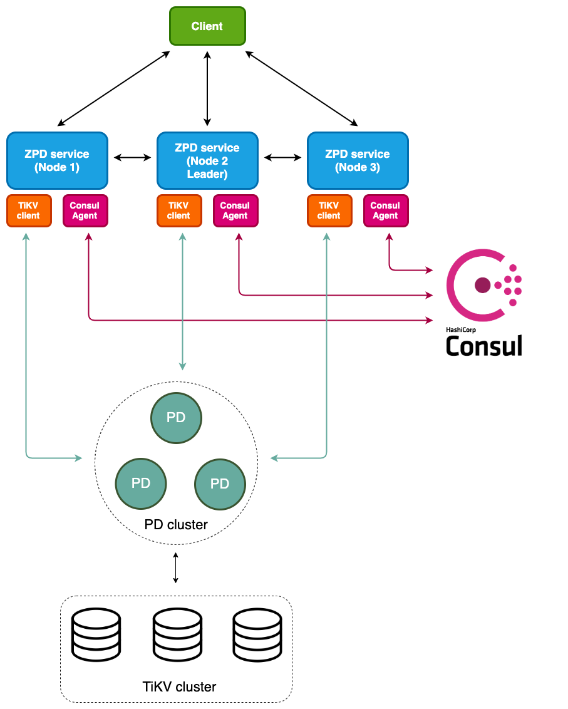
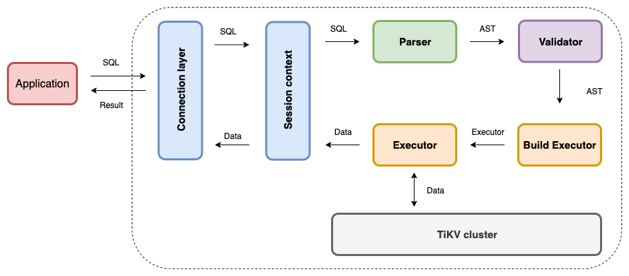
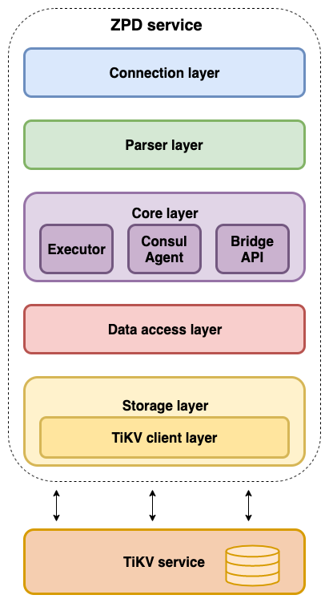

# ZPD


<div align="center">
  
</div>

- [ZPD](#zpd)
  - [Overview](#overview)
  - [Architecture](#architecture)
  - [Requirement](#requirement)
  - [Install](#install)
  - [Build](#build)
  - [Run](#run)
  - [Test](#test)
  - [Document](#document)
  - [Contribution](#contribution)
  - [Acknowledgments](#acknowledgments)

## Overview

ZPD is the probationary challenge of [AJPham](https://github.com/phamtai97) in ZaloPay. The ZPD plays the role of receiving SQL requests from the client, then parse them into Abstract syntax tree (AST), map the SQL into a key-value form, and finally execute the data key-value down the storage tier. ZPD combined with [Consul](https://www.consul.io/) as the leader voting feature among ZPD nodes in the cluster. The ZPD storage section uses [TiKV](https://github.com/tikv/tikv) to store key-value and [PD](https://github.com/pingcap/pd) for management and compatibility. Cooperation with TiKV. Within the scope of this project, the ZPD can only execute a few simple SQL statements.

ZPD is implemented in Go language. Use [gRPC](https://github.com/grpc/grpc-go) to build protocols and services. ZPD operates with the following flow:

<div align="center">
  
</div>


## Architecture

The architecture of the ZPD:

<div align="center">
  
</div>

Including layers:

- Connection layer
- Parser layer
- Core layer:
  - Executor
  - Consul Agent
  - Bridge API
- Data access layer
- Storage:
  - TiKV client layer

See the architecture of ZPD [here](./docs/architecture.md).

## Requirement
- Golang version >= 1.12
- gRPC
- Docker version >= 17.06 and Docker Compose
- Locust

## Install
- Install [Golang](https://golang.org/doc/install)
- Install [gRPC](https://grpc.io/docs/quickstart/go/)
- Install [Docker](https://docs.docker.com/get-started/)
- Install [Locust](https://locust.io/)
- Install TiKV and PD using [Docker Compose](https://tikv.org/docs/3.0/tasks/deploy/docker-compose/)
- Install Consul bằng [Docker](https://hub.docker.com/_/consul).

## Build

Clone this project:

```sh
# Clone
$ git clone https://gitlab.zalopay.vn/zpx-core-team/tidb-internals.git
```

## Run

ZPD, PD, TiKV, Consul are all built with Docker compose. Just go to the docker-compose folder and run docker-compose up.

```sh
# go to the folder docker-compose
$ cd ./tidb-layer/source/docker-compose

# Run docker-compose
$ docker-compose up
```

## Test

Must run ZPD as the section above, then run tests of the APIs:

```sh
# go to cmd/client
$ cd ./tidb-layer/source/cmd/client

# run tests
$ go test -run TestClientExecuteCreateDB 
```

- You can write more tests into `client_test.go`  like the available format.

## Document

Read more document about ZPD:

- [Specific description](./docs/specific-description.md)
- [Sequence diagram](./docs/sequence-diagram.md)
- [Architecture ZPD](./docs/architecture.md)
- [Overview ZPD](docs/overview-ZPD.md)
- [Handle DDL in ZPD](docs/handle-ddl.md)

## Contribution

This project was built by [AJPham](https://github.com/phamtai97) and [Alex Nguyen](https://github.com/quocanh1897) under the guidance from [Anh Le (Andy)](https://github.com/anhldbk).

## Acknowledgments

- This project used open source:
  - [xwb1989/sqlparser](https://github.com/xwb1989/sqlparser): a SQL parser.
  - [Consul](https://github.com/hashicorp/consul): handle leader election.
  - [PingCap](https://github.com/pingcap): support PD and TiKV parts.
