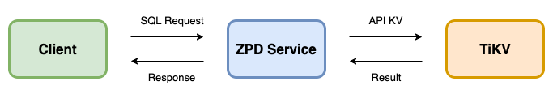
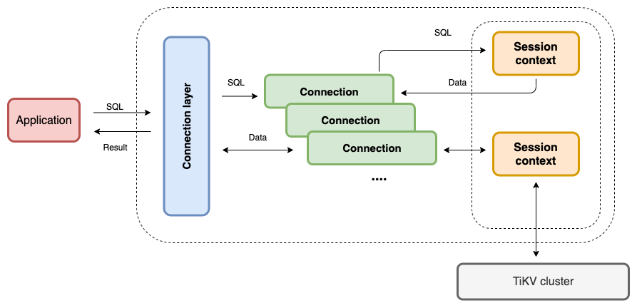
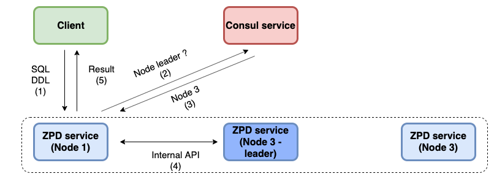
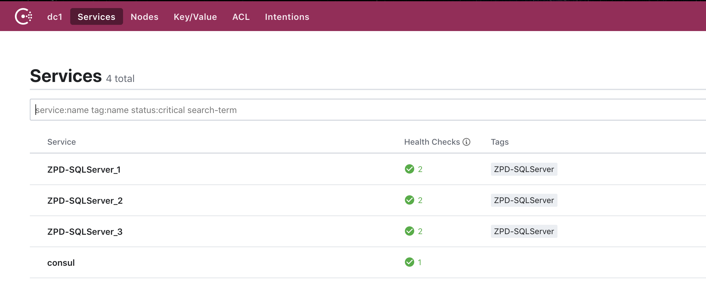

# Architecture ZPD service

- [Architecture ZPD service](#architecture-zpd-service)
  - [1. Giới thiệu](#1-gi%e1%bb%9bi-thi%e1%bb%87u)
  - [2. Architecture](#2-architecture)
    - [2.1 Overview](#21-overview)
    - [2.2 ZPD service layer](#22-zpd-service-layer)
      - [2.2.1 Connection layer](#221-connection-layer)
      - [2.2.2 Parser layer](#222-parser-layer)
      - [2.2.3 Core layer](#223-core-layer)
        - [2.2.3.1 Executor](#2231-executor)
        - [2.2.3.2 Consul Agent](#2232-consul-agent)
        - [2.3.3.4 Bridge API](#2334-bridge-api)
      - [2.2.4 Data access layer](#224-data-access-layer)
      - [2.2.5 Storage layer](#225-storage-layer)
        - [TiKV client layer](#tikv-client-layer)
  - [Model Overview](#model-overview)
## 1. Giới thiệu
Tài liệu này giới thiệu kiến trúc tổng quát của ZPD service, cũng như chi tiết các layer của ZPD service.

## 2. Architecture
### 2.1 Overview

  

Client gửi các SQL request tới các node ZPD service, ZPD service sẽ xử lý các request đó bằng cách kết hợp với TiKV.

### 2.2 ZPD service layer

  

#### 2.2.1 Connection layer

  

Connection layer có vai trò quản lí các connection tử clienr tới ZPD service, mỗi client connect tới ZPD service sẽ được mapping trong một global map theo dạng **[key;value]** như sau **[clientID; clientConn]**. Mỗi connection sẽ ứng với một `session`. Session chính là đại diện cho một client connection, session sẽ đi gọi qua các layer khác và nhận kết qủa trả về.

Ngoài ra, connection layer còn có nhiệm vụ encode và decode các gói tin gửi/nhận từ phía client. Khi nhận các gói tin request từ client, layer sẽ decode thành object tương ứng. Ngược lại layer sẽ encode kết quả trả về cho phía client.

#### 2.2.2 Parser layer
Các câu SQL sẽ được Parser layer phân tích thành `Abstract syntax tree (AST)`. Các bạn có thể tìm hiểu quá trình parse câu SQL thành AST [ở đây](https://medium.com/zalopay-engineering/sql-planning-parser-optimizer-ee118a9705ed). AST sẽ là input cho Core layer xây dựng thành các Executor để thực thi. Parser layer sử dụng package [sqlparser](https://github.com/xwb1989/sqlparser) để cung cấp chức năng parse câu SQL.

#### 2.2.3 Core layer
##### 2.2.3.1 Executor
Dựa vào AST được parse mà build thành các executor tương ứng để thực hiện các câu SQL. Đồng thời đảm nhận việc mapping data dạng Row của SQL thành dạng key-value lưu trữ ở TiKV service.

##### 2.2.3.2 Consul Agent
Đối với các câu SQL thuộc dạng DDL nó mang tính ảnh hưởng global trong database, vì thế để dễ dàng xử lý các câu SQL như vậy trong trường hợp có nhiều instance trong cluster thì giải pháp của ZPD service là chọn ra một node leader và chỉ có node leader mới có quyền thực hiện được các câu SQL DDL. Khi một yêu cầu thuộc SQL DDL được gọi tới node không phải là node leader thì node đó sẽ forward qua node leader và chờ nhận kết quả trả về. Để làm được mô hình như vậy, ZPD service sử dụng [Consul](https://www.consul.io/) service hỗ trợ. Để hiểu hơn về cách thực hiện các câu SQL DDL trong ZPD servie, các bạn có thể đọc ở [bài viết]() này. 
Consul Agent component đóng vài trò giao tiếp với Consul service. Khi khởi động ZPD service, Consul Agent component sẽ đăng khi với Consul service, và tận dụng Consul service để làm `Discovery serivce` cho hệ thống.
  
##### 2.3.3.4 Bridge API

  

Như ở phần trên đã đề cập đến việc forward các yêu cầu tới node leader, ZPD service xây dựng một Bridge API đảm nhận việc gọi API tới node leader. ZPD service chia làm hai loại API, một loại cho client sử dụng gọi là `public API`, loại còn lại để các ZPD service gọi tới node leader hay gọi là `internal API`. Để có thể gọi API đến node leader, Consul Agent component trước tiên sẽ gọi lên Consul service để lấy địa chỉ node leader, sau đó Bridge API component sẽ khởi tạo connection pool đến node leader.

#### 2.2.4 Data access layer
Đây là layer duy nhất trong ZPD service có thể giao tiếp với Storage layer để trao đổi dữ liệu. Data access layer sẽ cung cấp các API cho các tầng trên sử dụng, nó quản lý tất cả connection xuống Storage layer. Ở layer này chúng ta có thể phân quyền truy cập dữ liệu cũng như ngăn chặn các yêu cầu không hợp lệ xuống Storage layer.
  
#### 2.2.5 Storage layer
##### TiKV client layer
Để có thể giao tiếp với TiKV một cách dễ dàng, Storage layer đã sử dụng package [TiKV client](https://github.com/tikv/client-go) như là một SDK để có thể sử dụng linh hoạt các API của TiKV.

## Model Overview
Model tổng quan về mối liên hệ giữa ZPD service và các bên liên quan như Consul, PD cluster, TiKV cluster.

  

Sau khi kết nối với Consul:

  

