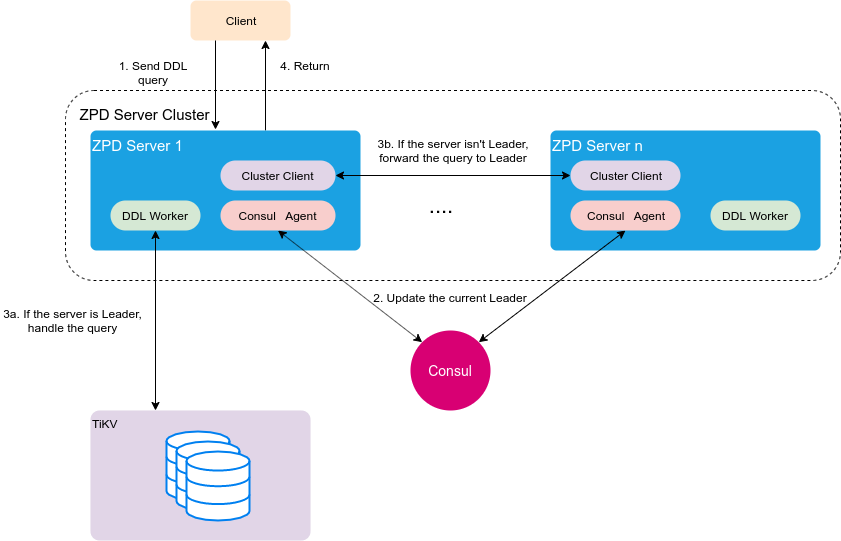

# Giải quyết bài toán thực thi DDL

## 1. Giới thiệu
Ở [phần này](overview-ZPD.md) đã giới thiệu kiến trúc của ZPD service, mình đã có nhắc tới phần thực thi câu lệnh [DDL](https://www.geeksforgeeks.org/sql-ddl-dql-dml-dcl-tcl-commands/) (Data Definition Language), DDL là những câu SQL statement: CREATE, ALTER, DROP. RENAME database/table . Các bạn có thể thấy các câu SQL DDL này mang tính ảnh hưởng cho toàn bộ hệ thống chúng ta. Ví dụ trong hệ thống không thể tạo hai database có cùng name, trong 1 database không thể có 2 table cùng name, .... Ở bài viết này mình sẽ giới thiệu về cách xử lý của ZPD service. Bên cạnh đó mình cũng sẽ giới thiệu qua cách xử lý câu DDL của [TiDB](https://github.com/pingcap/tidb).

## 2. Cách tiếp cận của TiDB

<div align="center">
  
</div>

TiDB sử dụng [protocol introduced by the Google F1 paper](https://static.googleusercontent.com/media/research.google.com/en//pubs/archive/41344.pdf) để implement DDL.

Có các thành phần chính sau:
- **TiDB server**: gồm TiDB's MySQL protocol và TiDB layer.
- **job**: mỗi DDL operation được tạo tương ứng một job. Các job được đánh id và đẩy vào job queue. Các job thực hiện xong sẽ được delete khỏi queue và đẩy vào history queue. Có hai loại queue: `general job` và `add index job`.
- **general job queue**: chứa general job , nằm ở TiKV layer, là duy nhất trong hệ thống.
- **add idx job queue**: chứa index job, nằm ở TiKV layer, là duy nhất trong hệ thống.
- **owner**: đóng vai trò leader duy nhất trong cụm. Các thông tin về node được chọn là owner được lưu ở `PD`. Chỉ node được bầu làm owner mới có quyền thực hiện các DDL operation. TiDB sử dụng `etcd` để lựa chọn owner.
- **worker**: mỗi node có 2 worker xử lý jobs. Chúng sẽ lấy job từ job queue để thực hiện. Khi nhận được notify có job, worker sẽ kiểm tra xem instance của nó có phải là owner không. Nếu đúng nó mới thực hiện job, ngược lại không làm gì.

**Flow thực hiện như sau:**

1. Client gửi DDL SQL đến TiDB.
2. TiDB Layer sẽ thực hiện parser, optimize và execute câu SQL. TiDB layer sẽ tạo job tương ứng với DDL operation đó và đẩy vào DDL queue của tầng KV layer. Sau đó thông báo tới các worker có trong cụm.
3. Các workers nhận được job notificaition, sẽ kiểm tra xem mình có phải là owner không. Nếu là owner sẽ thực hiện job đó. Nếu không thì không làm gì cả. Các worker ở node owner sẽ định kỳ kiểm tra queue để thực hiện job trong queue.
4. Khi worker thực hiện xong, nó sẽ remove job từ job queue sang job history. Kết thúc quá trình xử lý DDL.
5. TiDB trả kết quả về phía Client.

## 3. Cách tiếp cận ZPD service

Trong hệ thống ZPD ta áp dụng một cách khác để thực hiện câu DDL. Sau đây là mô hình hoạt động:

<div align="center">
  
</div>

ZPD serviec cũng chỉ cho phép duy nhất một instance trong cluster thực hiện các câu DDL. Để chọn ra instance đó, ZPD service đã sử dụng [Consul](https://www.consul.io/). Các instance ZPD service đăng ký lên Consul và khởi tạo session, mỗi sesion sẽ được phân biệt bởi sessionID. Sau đó các instance sẽ sử dụng sessionID yêu cầu lấy lock cho một key đã quy định từ trước, instance nào lấy được lock sẽ trở thành leader. Consul sẽ dựa vào sessionID để biết được instance nào đang là leader. Sesssion cần được làm mới trong khoảng thời gian nhất định, nếu như bị timeout thì session sẽ bị huỷ và vai trò leader sẽ được chuyển qua một instance khác.

Bên cạnh việc sử dụng Consul làm nơi bình chọn leader, mình đã sử dụng Consul làm discovery service, sử dụng tính năng health check để kiểm tra service còn hoạt động hay không, và sử dụng Consul để quản lý một số configuration.

**Flow xử lý câu DDL như sau:**
1. Client gửi DDL SQL đến bất kỳ instance ZPD service.
2. ZPD service nhận được yêu cầu sẽ kiểm tra xem mình có phải leader không. Nếu instance là leader sẽ thực thi câu DDL.
3. Nếu instance không phải là leader, nó sẽ gọi lên Consul để lấy địa chỉ leader hiện tại, sau đó sẽ gọi internal API đến leader để thực hiện câu DDL và chờ kết qủa để trả về cho client.

Ví dụ khi chúng ta thực hiện câu SQL `CREATE DATABASE`

- TH1 ZPD là node leader

```plantuml
title Create Database

Client->ZPD: create Database
ZPD->Consul: check leader
Consul-->ZPD: true
ZPD->TiKV: check database exists
alt database exists
TiKV-->ZPD: Yes
ZPD-->Client: response database exists
else database does not exists
TiKV-->ZPD: No
ZPD-->ZPD: prepare (key, value)
ZPD->TiKV: put (key, value)
alt put key-value pair success
TiKV-->ZPD: success
ZPD-->Client: response create database success
else put key-value pair fail
TiKV-->ZPD: fail
ZPD-->Client: response create database fail
end
end
```

- TH2 ZPD không phải node leader

```plantuml
title Create Database

Client->ZPD: create Database
ZPD->Consul: check leader
Consul-->ZPD: false
ZPD->Consul: get infomation current leader
Consul-->ZPD: infomation current leader
ZPD->ZPDLeader: create connection
alt if creating connection success
ZPDLeader-->ZPD: success
ZPD->ZPDLeader: call internal API Create Database
ZPDLeader-->ZPDLeader: handle API
alt handle success
ZPDLeader-->ZPD: response create database success
ZPD-->Client: response create database success
else handle fail
ZPDLeader-->ZPD: response create database fail
ZPD-->Client: response create database fail
end
else if creating connection fail
ZPDLeader-->ZPD: fail
ZPD-->Client: response create database fail
end
```

## 4. Kết luận
Việc implement project ZPD service này đã tạo cơ hội cho mình có thêm kiến thức mới về Consul và cách tiếp cận xử lý câu DDL SQL của TiDB. Bên cạnh đó mình cũng đã tự implement một cách xử lý câu DDL SQL cho ZPD servic dựa trên việc bình chọn leader của Consul.