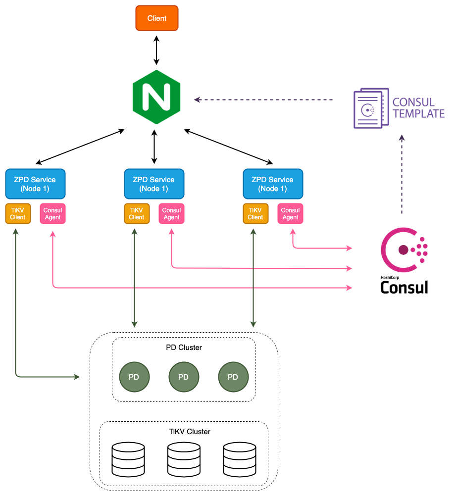

# Blog Overview ZPD service

## 1. Giới thiệu

Hiện nay key-value store hay key-value database đang được sử dụng rất phổ biến, có thể kể đến như CouchDB, FoundationDB, Redis, Berkeley DB. Sử dụng key-value store để lưu trữ dữ liệu có rất nhiều ưu điểm như dễ dàng scale, performance tốt, tính sẵn sàng cao. Nhiều hệ thống muốn sử dụng các cú pháp của SQL mà bên dưới vẫn tận dụng các ưu điểm của key-value store để lưu trữ. Với nhu cầu đó chúng ta cần có một layer nằm trên key-value store đảm nhận vai trò parser câu SQL (SQL layer) và thực thi câu SQL đó xuống key-value store.

ZPD service - ZaloPay Database service được xây dựng như một SQL layer nằm ngay trên key-value store. Key-value store ZPD service sử dụng là [TiKV](https://github.com/tikv/tikv) và dùng [PD](https://github.com/pingcap/pd) để quản lí và tương tác với TiKV.

Ở bài viết này xin giới thiệu về tổng thể kiến trúc và các hoạt động của ZPD service.

## 2. Tổng quan ZPD service

ZPD service có tính chất `stateless` vì tất cả dữ liệu đều được lưu trữ dưới TiKV, ZPD chỉ đứng vai trò nhận và thực thi câu SQL xuống TiKV. ZPD service được viết bằng ngôn ngữ [Go](https://golang.org/), sử dụng [protobuf](https://developers.google.com/protocol-buffers/?hl=vi) để định nghĩa các gói tin, đồng thời kết hợp với framework [gRPC](https://grpc.io/) để xây dựng protocol và service.

ZPD service có khả năng scale bằng cách thêm nhiều instance vào trong cluster. Đồng thời ZPD service
 dùng [Consul](https://www.consul.io/) làm discovery service và dùng tính năng [election leader](https://www.consul.io/docs/internals/sessions.html#leader-election) của Consul để chọn leader giữa các instance ZPD service.

ZPD service sử dụng package [TiKV-Client](https://github.com/tikv/client-go) như là một SDK để có thể dễ dàng giao tiếp với TiKV và PD. Tổng quan mô hình ZPD service khi deploy 3 instance như sau:

<div align="center">
  
</div>

ZPD service cơ bản hoạt động theo flow sau: quản lí các kết nối từ phía client, khi có client gửi request yêu cầu thực thi câu SQL nào đó, ZPD service sẽ parse câu SQL thành Abstract syntax tree (AST), sau đó validate AST có hợp lệ hay không. Từ AST đã được validate, ZPD service xây dựng executor tương ứng với AST và thực thi câu SQL xuống TiKV. Cuối cùng trả kết quả về cho client. Sơ đồ mô tả flow như sau:

<div align="center">
  
</div>

Phần tiếp theo chúng ta sẽ đi chi tiết hơn kiến trúc bên trong của ZPD service, cùng nhìn qua các layer bên trong ZPD service và vai trò từng layer.

## 3. Kiến trúc ZPD service

ZPD service đơn giản chỉ đóng vai trò parse câu SQL và thực thi câu SQL xuống key-value store nhưng bên trong kiến trúc vẫn chia thành các layer đảm nhận những chức năng khác nhau. Việc phân chia service thành các layer rất có lợi cho việc scale up, việc test chức năng và tận dụng lại các layer cho các mục đích sau này. Sau đây là mô hình kiến trúc tổng thể của ZPD service:

<div align="center">
  
</div>

ZPD service được chia thành các layer sau:

- Connection layer
- Parser layer
- Core layer
- Data access layer
- Storage layer

### 3.1 Connection layer

<div align="center">
  
</div>

Connection layer có vai trò quản lí các connection tử clienr tới ZPD service, mỗi client connect tới ZPD service sẽ được mapping trong một global map theo dạng **[key;value]** như sau **[clientID; clientConn]**. Mỗi connection sẽ ứng với một `session`. Session chính là đại diện cho một client connection, session sẽ đi gọi qua các layer khác và nhận kết qủa trả về.

Ngoài ra, connection layer còn có nhiệm vụ encode và decode các gói tin gửi/nhận từ phía client. Khi nhận các gói tin request từ client, layer sẽ decode thành object tương ứng. Ngược lại layer sẽ encode kết quả trả về cho phía client.

### 3.2 Parser layer

Các câu SQL sẽ được Parser layer phân tích thành `Abstract syntax tree (AST)`. Các bạn có thể tìm hiểu quá trình parse câu SQL thành AST [ở đây](https://medium.com/zalopay-engineering/sql-planning-parser-optimizer-ee118a9705ed). AST sẽ là input cho Core layer xây dựng thành các Executor để thực thi. Parser layer sử dụng package [sqlparser](https://github.com/xwb1989/sqlparser) để cung cấp chức năng parse câu SQL.

### 3.3 Core layer

Phần Core layer chia thành 3 component:

- Executor
- Consul Agent
- Bride API

#### 3.3.1 Executor component

Khi nhận được AST từ Parser layer đẩy xuống, Executor component trước tiên sẽ validate AST xem có hợp lệ hay không. Một số rule đặt ra như kiểm tra số lượng columns, kiểm tra confict về column name, kiểu dữ liệu,... Số rule sẽ được thêm vào cho những lần nâng cấp sau. Sau khi validate thành công, Executor component sẽ thực hiện việc xây dựng executor tương ứng với cây AST. Hiện tại ZPD service đã xây dựng các executor sau:

- DBDDLExec: executor thực hiện các Data Definition Language (DDL) SQL liên quan tới database như `CREATE DATABASE`, `DROP DATABASE`.
- DDLExec: executor thực hiện các DDL SQL liên quan tới table như `CREATE TABLE`, `DROP TABLE`.
- UseExec: executor thực hiện câu SQL `USE DATABASE`.
- ShowDBExec: executor thực hiện câu SQL `SHOW DATABASE`.
- ShowTBExec: executor thực hiện câu SQL `SHOW TABLE`.
- InsertExec: executor thực hiện câu SQL `INSERT`.
- DeleteExec: executor thực hiện câu SQL `DELETE`.
- SelectExec: executor thực hiện câu SQL `SELECT`.

Ngoài việc xây dựng được các executor tương ứng, Executor component còn đảm nhận vai trò mapping dữ liệu câu SQL thành dạng key-value để có thể lưu trữ được. Phần mapping dữ liệu sẽ được trình bày ở [bài viết]() này. Tuỳ loại yêu cầu SQL mà có mapping dữ liệu hay không, sau khi việc mapping hoàn tất thì executor sẽ trực tiếp gọi xuống tầng Data access layer để thực thi câu lệnh SQL.

#### 3.3.2 Consul Agent component

Đối với các câu SQL thuộc dạng DDL nó mang tính ảnh hưởng global trong database, vì thế để dễ dàng xử lý các câu SQL như vậy trong trường hợp có nhiều instance trong cluster thì giải pháp của ZPD service là chọn ra một node leader và chỉ có node leader mới có quyền thực hiện được các câu SQL DDL. Khi một yêu cầu thuộc SQL DDL được gọi tới node không phải là node leader thì node đó sẽ forward qua node leader và chờ nhận kết quả trả về. Để làm được mô hình như vậy, ZPD service sử dụng [Consul](https://www.consul.io/) service hỗ trợ. Để hiểu hơn về cách thực hiện các câu SQL DDL trong ZPD servie, các bạn có thể đọc ở [bài viết]() này.
Consul Agent component đóng vài trò giao tiếp với Consul service. Khi khởi động ZPD service, Consul Agent component sẽ đăng khi với Consul service, và tận dụng Consul service để làm `Discovery serivce` cho hệ thống.

#### 3.3.3 Bridge API component

<div align="center">
  
</div>

Như ở phần trên đã đề cập đến việc forward các yêu cầu tới node leader, ZPD service xây dựng một Bridge API đảm nhận việc gọi API tới node leader. ZPD service chia làm hai loại API, một loại cho client sử dụng gọi là `public API`, loại còn lại để các ZPD service gọi tới node leader hay gọi là `internal API`. Để có thể gọi API đến node leader, Consul Agent component trước tiên gọi lên Consul service để lấy địa chỉ node leader, sau đó Bridge API component sẽ khởi tạo connection pool và dùng connection trong connection pool để gọi tới node leader.

### 3.4 Data access layer

Đây là layer duy nhất trong ZPD service có thể giao tiếp với Storage layer để trao đổi dữ liệu. Data access layer sẽ cung cấp các API cho các tầng trên sử dụng, nó quản lý tất cả connection xuống Storage layer. Ở layer này chúng ta có thể phân quyền truy cập dữ liệu cũng như ngăn chặn các yêu cầu không hợp lệ xuống Storage layer.

### 3.5 Storage layer

Để có thể giao tiếp với TiKV một cách dễ dàng, Storage layer đã sử dụng package [TiKV client](https://github.com/tikv/client-go) như là một SDK để có thể sử dụng linh hoạt các API của TiKV.

## 4. Các API cung cấp

Hiện tại ZPD service cung cấp 3 API như sau:

- ConnectDatabase: dùng để connect tới ZPD service ứng với database muốn connect.
- CloseConnectionDatabase: đóng connection tới ZPD service.
- ExecuteStatement: là API chứa các câu SQL muốn thực hiện.

Hiện tại các câu SQL mà ZPD service có thể thực thi còn khá đơn giản, bao gồm:

- Create database:

```sql
CREATE DATABASE db_0;
```

- Use database:

```sql
USE db_0;
```

- Drop database:

```sql
DROP DATABASE db_0;
```

- Show database:

```sql
SHOW DATABASES;
```

- Create table:

```sql
CREATE TABLE `table_0` (`id` int(200) NOT NULL, `name` varchar (10), PRIMARY KEY (`id`));

CREATE TABLE `table_0` (`id` int(200), `name` varchar (10), PRIMARY KEY (`id`), INDEX test_index(`name`));

CREATE TABLE `table_0` (`id` int(200), `name` varchar (10), `gmail` varchar(10), PRIMARY KEY (`id`), INDEX `test_index`(`name`, `gmail`));

CREATE TABLE `table_0` (`id` int(200), `name` varchar (10), `gmail` varchar(10), PRIMARY KEY (`id`), INDEX `test_index`(`name`), INDEX `test_index_0` (`gmail`));
```

- Drop table

```sql
DROP TABLE table_0;
```

- Show table

```sql
SHOW TABLES;
SHOW TABLES FROM db_0;
```

- Insert row

```sql
INSERT INTO table_0(ID, Name, gmail) VALUES (10000000, 'taiptht', 'taiptht@gmail.com'), (20000000, 'thinhda', 'thinhda@gmail.com');
```

- Select row

```sql
SELECT * FROM table_0;
SELECT ID, Gmail FROM table_0
SELECT * FROM table_0 WHERE ID = 1; (có index)
SELECT * FROM table_0 WHERE gmail = 'taiptht@gmail.com'; (không có index)
```

- Delete row

```sql
DELETE FROM table_0  WHERE ID = 0
DELETE FROM table_0 WHERE gmai ='taiptht@gmail.com'
```

## 5. Cải tiến

<div align="center">
  
</div>

Chúng ta có thể sử dụng thêm [NGINX](https://www.nginx.com/resources/wiki/) để load balance. Đồng thời sử dụng [Consul-template](https://github.com/hashicorp/consul-template) để quản lí file config của NGINX thông qua việc nhận các sự thay đổi từ Consul. Ngoài ra việc sử dụng Consul và Consul-template giúp cho việc vận hành các service rất dễ dàng như việc deploy version mới của service, quản lý configuration, health check, service discovery.

## 6. Kết luận

Ở bài viết này đã giới thiệu tổng quan của ZPD service, cũng như trình bày chi tiết các layer trong kiến trúc của ZPD service. Qua đó có thể thấy ZPD service có khả năng scale tốt, đồng thời là sự kết hợp ăn ý với các service ở bên thứ ba như Consul service, TiKV, PD, TiKV client. ZPD service cung cấp hai loại API là public và internal để phục vụ các yêu cầu của client. Ngoài ra ZPD service đã thực hiện được các câu SQL cơ bản, và tương lai sẽ hoàn thiện hơn về mặt chức năng cũng như kiến trúc bên trong.
